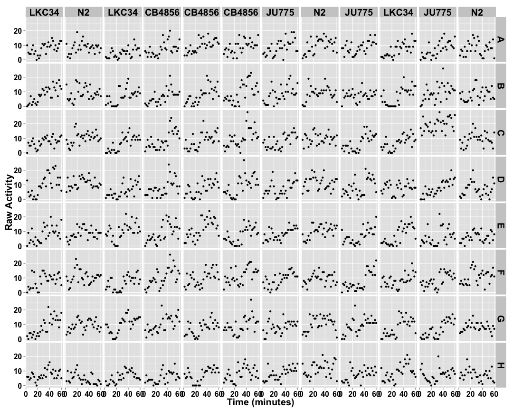
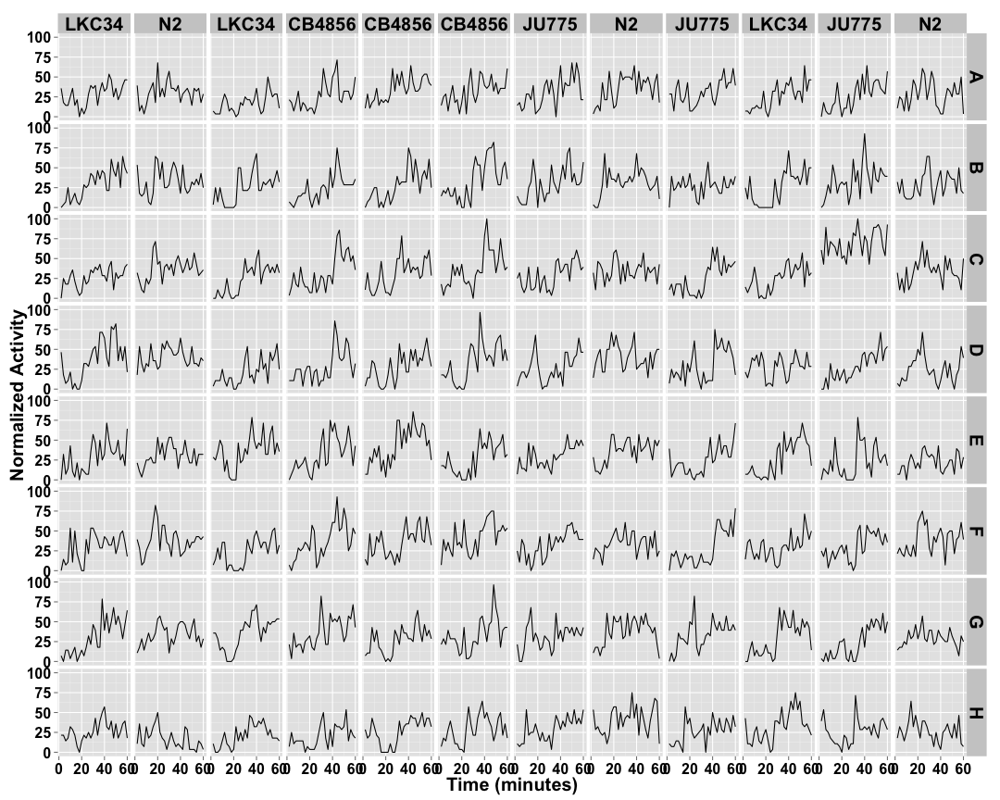
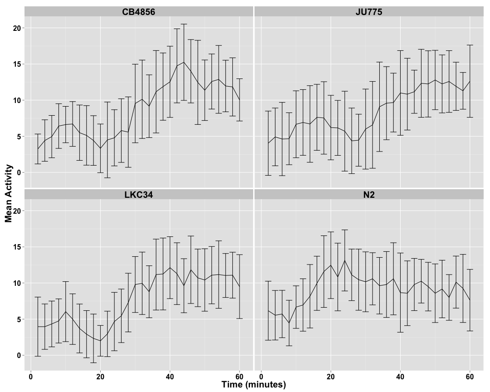
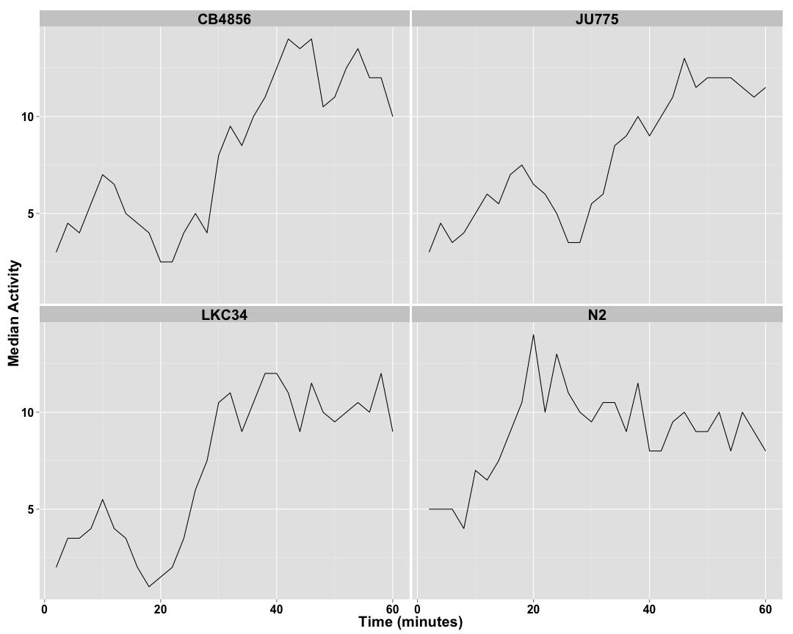
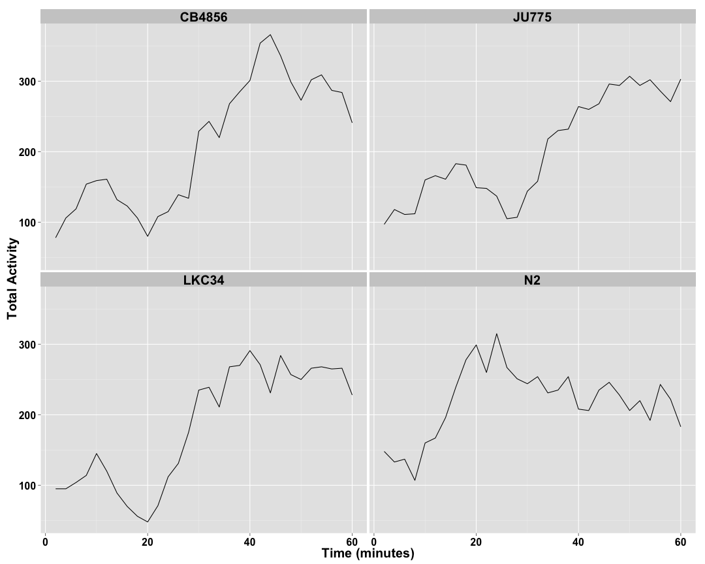
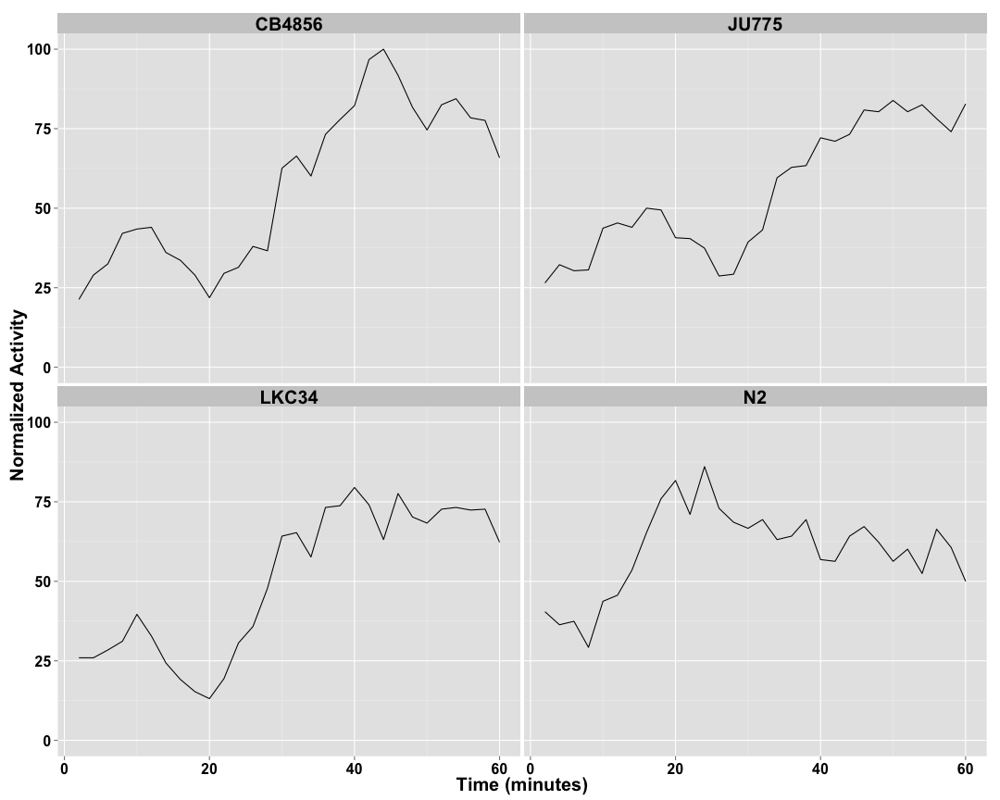

```
## [1] "p01_levamisole_150"
```


## Raw Activity ##

 

## Cleaned Data ##


 

## Well Normalized Data ##


 


## Strain Mean Data ##

 

## Strain Median Data ##

 

## Strain Total Data ##

 

## Strain Normalized Data ##


 
