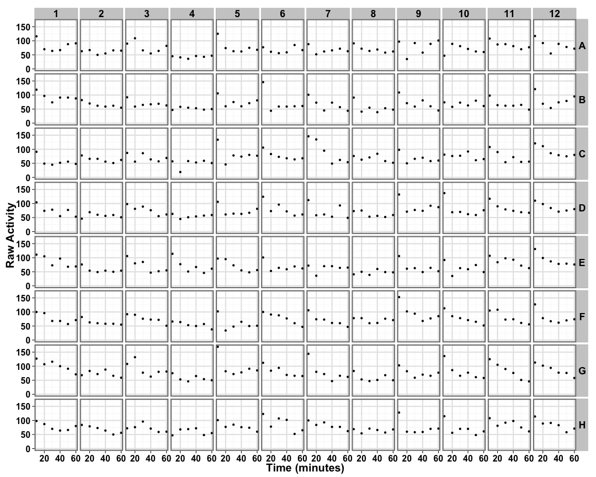
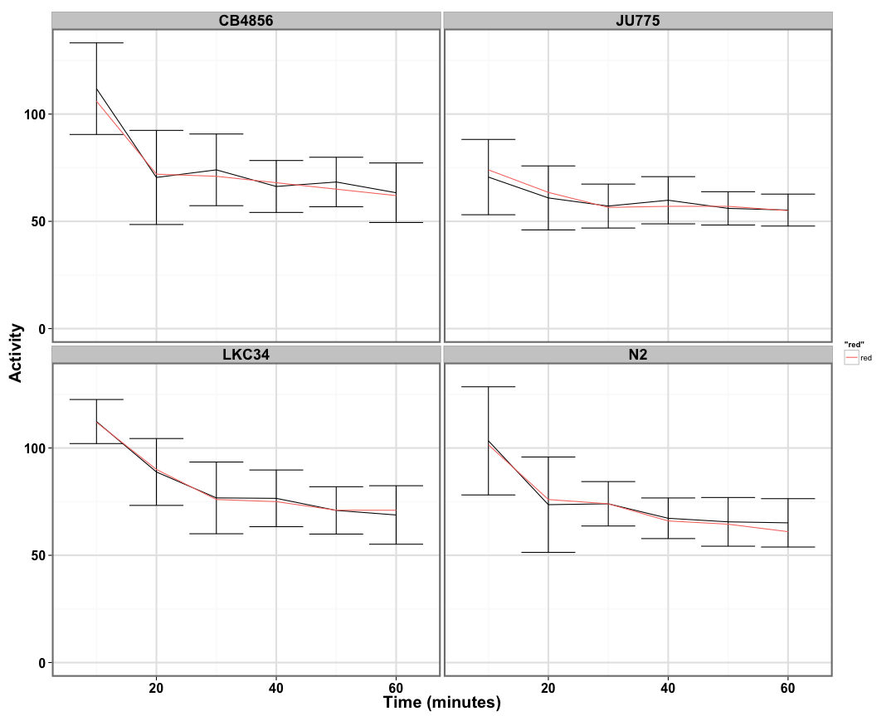
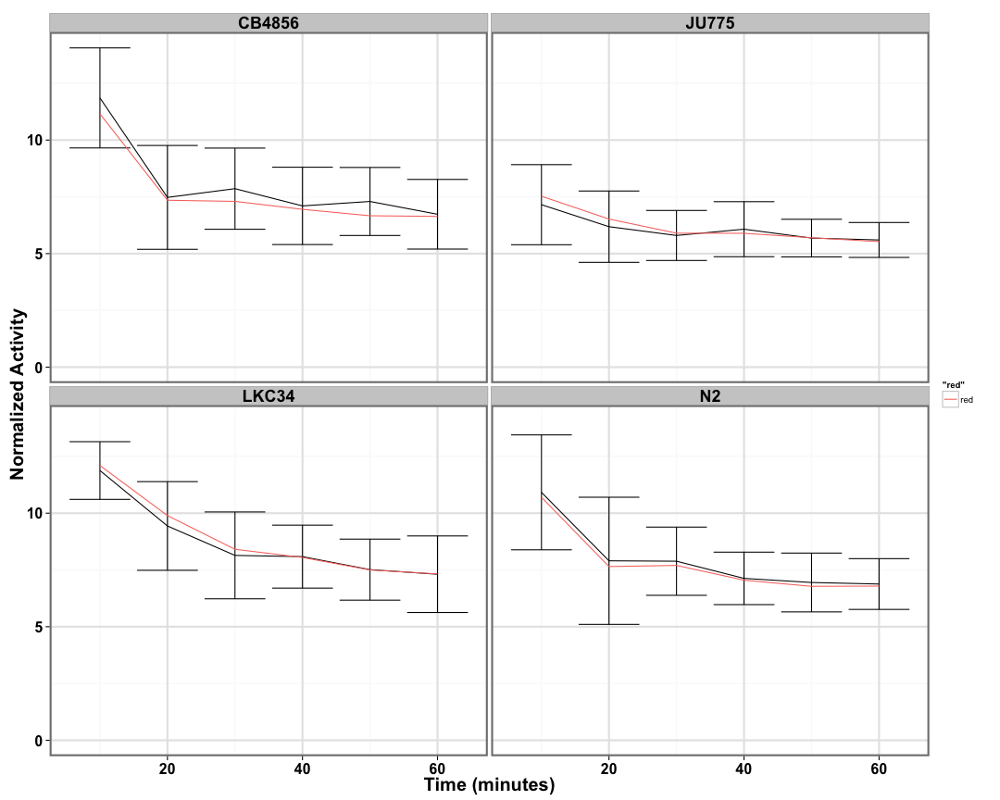
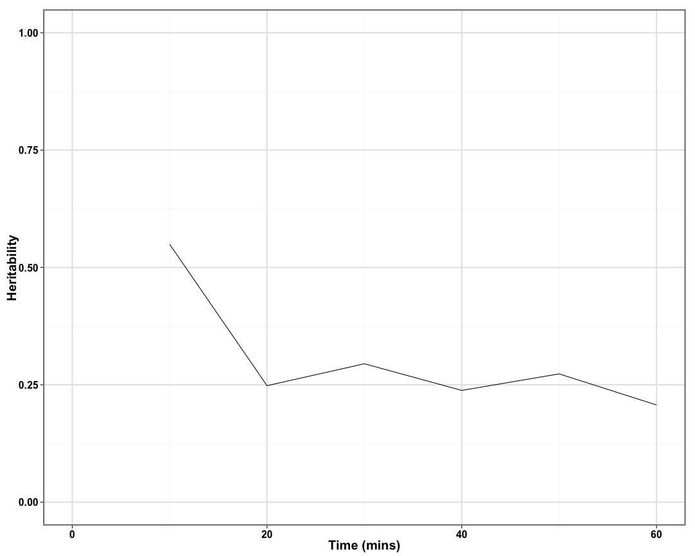

```
## [1] "p02_zolvix"
```


## Raw Activity ##

 


## Strain Mean and Median Data ##

 

## Strain Normalized Mean and Median Data ##

 

## Difference in Phenotype at Time Point of Interest ##

 


## Heritability of Response Over Time ##

 

